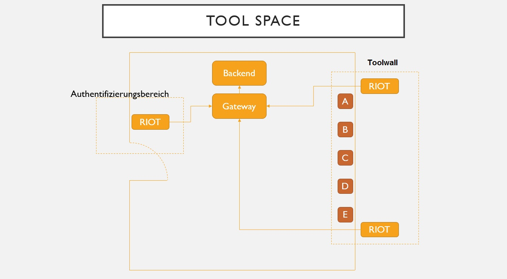
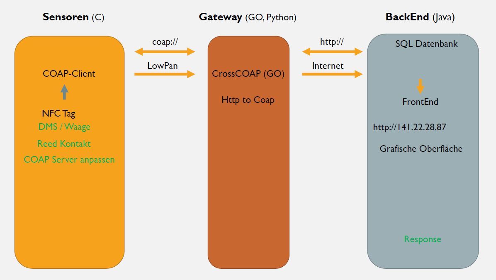

# SmartToolStation
  
WS 2017/18 - RIOT im Internet of Things - Bachelor Project of Computer Science and Electrical Engineering 
   
# What is ToolSpace?
  
ToolSpace is a management system for monitoring and administration of a tool workspace.
The goal is to develop a system, wich can be easy installed and manage diffrent tools in a comfortable and smart way.
At the entrance of the workspace, the user sign in by NFC. To rent a tool, the user first loggs into the rental terminal, afterwards he scan the required tools.
Every tool and every user has his unigue NFC tag. 
To return the tools, the user only has to place the tool back to the tool wall.
        


**Toolwall**
  
  - A: Tool with NFC tag (:hammer:)
  - B: Tool with NFC tag (chisel)
  - C: bold scale
  - D: gauge with NFC tag, reading device
  - E: gauge with NFC tag, reading device, electronical lock
  


    
# System Overview
   



## Sensor

For detecting the tools at the wall or for logging into the Toolstation, we use NFC tags. The RIOT Bord is connected with NFC sensors. Every information about the system will be send to the backend, where it will be handled and stored. For example the login of an already registered user looks like:

``` c
put("fe80::1ac0:ffee:1ac0:ffee","/login", testdatenNeu);
```

The variable `testdatenNeu` contains the NFC tag, send to the `LoginRepository` of the `Applicatinfaceadecontroller` in the backend via gateway. When a user tries to log in, a green or red LED will signalize the success or fail.

## Gateway

The gateway has its use in translating `COAP` to `HTTP` or backwards. The commmunication to the Riot boards works via COAP and with the backend HTTP is spoken. This translation exspires via `CrossCOAP` (GO). The commmunication to the backendserver runs via HAW router and the internet. Communicate out of the HAW wokrs fine, but wehn the backendservers tries to answer the gateway request, it ist not allowed to use any of the router ports. First solution would be, to unlock a port, but that is to difficulte and not allowed in the university. The second solution is, to assamble an SSH tunnel. The process for assambling the SSH tunnel will look like:

``` pi
...
pi@raspberrypi:~cd .ssh		
pi@raspberrypi:~cat id_rsa.pub		//show publickey
ssh-rsa XXX pi@raspberrypi		//copy all

****************************Shell changing to Servername@user:~$
Servername@user:~$ cd .ssh
Servername@user:~/.ssh$ ls	//no authorized_keys avalible
Servername@user:~/.ssh$ nano authorized_keys // copy "ssh-rsa XXX pi@raspberrypi" into the file
Servername@user:~/.ssh$ ls	//control for authorization
authorized_keys				// Keys authorized
Servername@user:~/.ssh$ chmod 600 authorized_keys	//authorization

****************************Shell changing to pi@raspberrypi~ $
pi@raspberrypi~ $ ssh -fN -R 3000:localhost:3001 Servername@000.000.000.000 //reverse ssh
//3001: Server
//3000: Raspy an Servererver
...
```

## Backend

## Frontend

# ToDo Overview
- [x] README.md erstellen
- [ ] Milestones:
  - [ ] Präsentation des Projekts
  - [ ] First Mock-Up Demo
  - [ ] Release Candidate 1
  - [ ] Final Presentation
- [x] list syntax required (any unordered or ordered list supported)
- [x] this is a complete item
- [ ] this is an incomplete item
